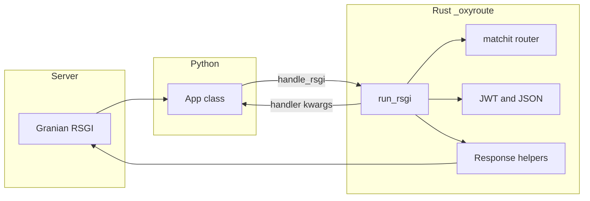

# OxyRoute documentation

OxyRoute is a small **RSGI-oriented** framework: the native **Rust** extension handles HTTP matching, JSON parsing, optional JWT checks, and response construction, while your code stays in **Python** functions or coroutines.

The primary integration is **[Granian](https://github.com/emmett-framework/granian)** with **`--interface rsgi`**, which calls your application’s `async def __rsgi__(scope, protocol)` on each connection. OxyRoute’s `App` type implements that contract and delegates to a PyO3 `App` that runs the async `run_rsgi` pipeline in Rust.

## Architecture (high level)

Granian still invokes a Python `App` object; the “win” is doing routing, body parsing, and JWT in **one native layer** before your handler runs, instead of a heavier pure-Python stack.

**Note:** A full “zero GIL at the process boundary” is not claimed—OxyRoute reduces Python work on the request path, not the server’s own scheduling.

## Table of contents

| Topic | Description |
|--------|-------------|
| [Installation](installation.md) | `pip`, `oxyroute[dev]`, building with Cargo/maturin, troubleshooting |
| [RSGI and Granian](rsgi.md) | Why RSGI, `__rsgi__`, lifespan hooks, spec link |
| [Routing](routing.md) | Path patterns, methods, 404s |
| [Handlers](handlers.md) | Injected parameters, return types, JSON encoding |
| [CORS](cors.md) | `CORSConfig`, preflight, `apply_cors` |
| [Security headers](security-headers.md) | `SecurityHeadersConfig`, HSTS, CSP |
| [CSRF](csrf.md) | Double-submit, `apply_csrf`, `csrf_layer` + CORS |
| [JWT](jwt.md) | `require_jwt`, HS* / RSA / EC PEM, `decode_jwt_hs` (HS* tests) |
| [HTTP/2 with Granian](http2.md) | Transport guarantees vs server/proxy responsibilities |
| [Dependencies](dependencies.md) | `Depends`, `dependencies=[...]`, `freeze` |
| [OpenAPI](openapi.md) | `openapi.json` route, title, `openapi_json()` |
| [ASGI bridge](asgi.md) | Optional `__call__` for ASGI 3, limitations |
| [Development](development.md) | Tests, CI, PyPI releases (tag `v*`), clippy, pytest |
| [Branching and PRs](development-workflow.md) | `dev` as base, issue branches, `Closes #N`, no mixing code with `ISSUE_BACKLOG` in one commit |
| [Feature gaps (research)](feature.md) | What is missing vs a “full” HTTP framework (multipart, WS, sub-routers, etc.) — Russian |
| [Contributing](../CONTRIBUTING.md) | Local setup, issue backlog, GitHub `gh` workflow |

[← Back to project README](../README.md)
